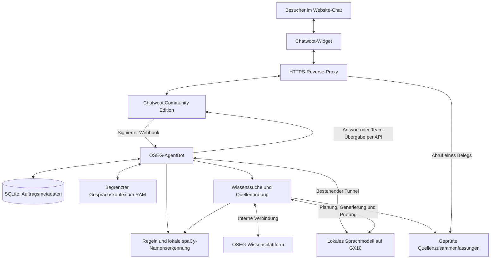

# Architektur von OSEGChat

Stand: **20. September 2026**. Diese Beschreibung dokumentiert die bestehende OSEG-Integration in Chatwoot Community Edition. Die genannten Python- und JavaScript-Dateien bezeichnen Komponenten der betriebenen Anwendung; ihr Quellcode ist derzeit nicht Bestandteil dieses Repositorys.

## Ziele und Abgrenzung

OSEGChat beantwortet sachliche Fragen zu OSEG anhand der freigegebenen Wissensbasis, spricht Besucher in Du-Form an und bleibt ausdrücklich als KI erkennbar. Freie Fragen und neue, belegte Formulierungen sind erlaubt. Fehlende Belege, Datenschutzprobleme oder technische Fehler dürfen nicht zur Ausgabe eines ungeprüften Antwortentwurfs führen.

Die Integration verwendet einen eigenen Chatwoot-AgentBot-Dienst. Ein kommerzielles KI-Angebot von Chatwoot ist für diesen beschriebenen Antwortweg nicht erforderlich. Der Bot ist kein allgemeiner Assistent und führt keine vom Besucher angeforderten Programme, Werkzeuge oder externen Aktionen aus.

## Komponenten und Verbindungen

| Komponente | Aufgabe |
| --- | --- |
| Chatwoot Community Edition | Postfächer, Nachrichten, AgentBot-Anbindung und menschliche Bearbeitung. Chatwoot wird mit Docker betrieben. |
| HTTPS-Reverse-Proxy | Öffentliche Weiterleitung der benötigten Chat-, Webhook-, Widget- und Quellenrouten. Der Bot-Gesundheitsendpunkt bleibt intern. |
| `bot.py` | Webhook-Prüfung, Nachrichtenklassifizierung, Queue, Antwortprozesse, Chatwoot-API und Übergabe. Der Bot läuft als eigener Dienst neben Chatwoot. |
| `dynamic_knowledge.py` | Quellenverzeichnis, Volltextsuche, Dokumentabruf, Bereinigung, Antwortgenerierung und semantische Prüfung. |
| `privacy.py` | Unicode-Normalisierung, regelbasierte Erkennung sensibler Angaben und lokale Erkennung von Personennamen mit spaCy. |
| `conversation_memory.py` | Kurzer datenschutzgeprüfter Kontext je Gespräch mit Ablaufzeit. |
| `source_views.py` | Zeitlich begrenzte, öffentlich abrufbare Zusammenfassungen freigegebener Aussagen. |
| `typing_indicator.py` und `metrics.py` | Schreibanzeige sowie aggregierte Ergebnis- und Laufzeitkennzahlen. |
| Widget-Erweiterungen | Deutsche Du-Ansprache, KI-/Team-Kennzeichnung, Quellenanzeige, Leseposition und Anpassung an die Bildschirmtastatur. |
| OSEG-Wissensplattform | Verzeichnis freigegebener Quellen, Volltextsuche, Dokumente, Revisionen und Inhalte. Öffentlich erreichbar über [wissen.oseg.rocks](https://wissen.oseg.rocks/). |
| GX10-Modellserver | Lokale Inferenz für Klassifizierung, Gesprächsbezug, Suche, Antwort und Validierung. |

## Verarbeitung einer Nachricht

### 1. Eingang und Auftragsverwaltung

Der AgentBot akzeptiert nur passende eingehende Ereignisse aus den konfigurierten Postfächern. Er prüft die Webhook-Signatur mittels HMAC und eine zeitliche Gültigkeit. Nachrichtenformat und Größe sind begrenzt; pro ausgewerteter Nachricht sind höchstens 500 Textzeichen vorgesehen. Anhänge führen nicht zu einer automatischen Inhaltsauswertung.

Eine SQLite-Queue hält Nachrichten- und Gesprächskennungen, Status und Zeitangaben fest. Nachrichtentext liegt für die Bearbeitung im RAM. Zusammengehörige, kurz aufeinanderfolgende Nachrichten können zusammengeführt werden. Zwei Antwortprozesse arbeiten parallel, jedoch nicht gleichzeitig an demselben Gespräch.

Vor der Bearbeitung und unmittelbar vor dem Versand prüft der Bot erneut, ob das Gespräch noch für ihn vorgesehen ist. Neuere Nachrichten, eine menschliche Übernahme oder ein geschlossener Gesprächsstatus können eine bereits laufende Bearbeitung überholen.

### 2. Format, Datenschutz, Thema und Kontext

Feste Regeln behandeln Begrüßungen, Dank, Übergabewünsche und eindeutig sensible Anfragen. Eine gemischte Anfrage kann auf eine eigenständige sachliche OSEG-Frage reduziert werden; diese wird erneut geprüft. Reine Fragen nach Personen werden nicht durch erfundene Sachfragen ersetzt.

Für Anschlussfragen kann der Bot den begrenzten Kontext desselben Gesprächs verwenden. Die aufgelöste Frage durchläuft erneut Datenschutz- und Themenprüfungen. Eine unklare OSEG-Frage erhält eine gezielte Rückfrage; bleibt der Bezug danach unklar, folgt die Übergabe.

Die Klassifizierung unterscheidet `allow`, `personal`, `outside`, `unsafe` und `clarify`. Ein Sitz auf Stadt-, Regions- oder Landesebene ist eine sachliche Organisationsangabe. Das erlaubt keine Auskunft über persönliche Wohnadressen, Straßen mit Hausnummern oder Kontakte.

Eine harmlose fachfremde Anfrage (`outside`) erhält einen Themenhinweis; das Gespräch bleibt beim Bot, damit nachfolgende OSEG-Fragen beantwortet werden können. Personenanfragen und Sicherheitsfälle führen weiterhin zu einer ausdrücklich angekündigten Übergabe. Eine Themenablehnung allein darf das Gespräch nicht dauerhaft für die KI sperren.

### 3. Wissenssuche und Bereinigung

Der Bot liest das aktuelle Quellenverzeichnis und berücksichtigt ausschließlich Quellen, deren Modellverarbeitung freigegeben ist. Ein Modellaufruf wählt passende Primärseiten und Suchbegriffe. Die Suche nutzt Volltextabfragen sowie eine an Quellenart, Titel und Suchtreffern orientierte Rangfolge; dieser Antwortweg setzt keine Vektordatenbank voraus.

Anschließend werden passende Dokumente und Textpassagen frisch abgerufen. Offizielle Vereinsseiten haben für Vereinsfragen Vorrang vor historischen Diskussionen. Bei Bedarf ist ein begrenzter erweiterter Suchlauf möglich.

Wird ein Suchplan vom Modell unvollständig ausgegeben, wird er verworfen und innerhalb des bestehenden Zeitbudgets einmal mit einem größeren Ausgabelimit neu erzeugt. Erst ein vollständiger Plan mit gültigem Schema, erlaubten Quellen und datenschutzgeprüften Suchbegriffen darf Suchabfragen auslösen. Eine erneut unvollständige Ausgabe führt zum sicheren Abbruch.

Vor der Antwortgenerierung werden Titel, Metadaten und ausgewählte Auszüge bereinigt. Der Bot entfernt erkannte Personennamen, Kontaktangaben, Adressen, Geheimnismuster, Autorenzeilen und Quell-URLs. Nicht die vollständigen Rohdokumente, sondern ausgewählte bereinigte Auszüge dienen dem Modell als Belege.

Optionale geprüfte Fakten in `reference_facts.json` unterstützen präzise Formulierungen nur bei weiterhin passender Dokumentrevision und passendem Inhalts-Hash. Sie sind keine Antwort-Whitelist. Neue oder geänderte Quellen können weiterhin über den normalen Abruf verwendet werden.

### 4. Generierung und Freigabe

Das lokale Modell erzeugt ein strukturiertes JSON-Ergebnis. Jede Sachbehauptung enthält Quellen-IDs. Schema, Datentypen, Längen und Belegverweise werden im Programm geprüft. Aussagen mit erkannten Personenangaben werden vollständig verworfen.

Ein separater Modellaufruf prüft die verbleibende Antwort. Für eine Freigabe müssen alle sechs Felder echte boolesche Werte mit dem Wert `true` sein:

| Feld | Bedeutung |
| --- | --- |
| `privacy_safe` | Keine unzulässigen personenbezogenen Angaben oder Geheimnisse. |
| `in_scope` | Sachlicher Bezug zur OSEG-Frage. |
| `grounded` | Aussagen durch die angegebenen bereinigten Quellen belegt. |
| `appropriate` | Passende Darstellung, Du-Form und keine vorgetäuschte Mitgliedschaft. |
| `complete` | Die Kernfrage bleibt auch nach Datenschutzkürzungen beantwortet. |
| `temporal_correct` | Historische Beschreibungen und Ziele werden nicht als aktuelle Zusagen ausgegeben. |

Zusätzliche Programmregeln prüfen unter anderem fehlende Definitionen und unbelegte Gegenwartsbehauptungen. Ein unzureichender Entwurf kann innerhalb eines begrenzten Zeitbudgets neu formuliert werden. Ein erneuter Abruf kontrolliert vor der Freigabe Quellenberechtigung, Revision und SHA-256-Inhalts-Hash. Änderungen während der Bearbeitung verhindern die Ausgabe auf Basis des überholten Quellenstands.

Fehlt nach den begrenzten Such- und Prüfversuchen eine ausreichend belegte Antwort (`no_evidence`), erklärt der Bot diese Grenze, bietet mit „Mensch“ die Team-Übergabe an und bleibt für weitere OSEG-Fragen erreichbar. Die fehlende Freigabe eines einzelnen Entwurfs beendet damit nicht das gesamte KI-Gespräch. Ungültige Ergebnisse oder technische Fehler können weiterhin eine ausdrücklich angekündigte Übergabe auslösen. Unsichere Antwortentwürfe werden nicht als Zwischenstand veröffentlicht.

### 5. Quellenanzeige und Übergabe

Antworten verweisen auf geprüfte Zusammenfassungen unter der öffentlichen Quellenroute des Bots. Diese Seiten enthalten freigegebene Aussagen, keine Rohdokumente, Autorenfelder oder Besucherfragen. Sie sind ausdrücklich als Zusammenfassungen gekennzeichnet und kein wörtlicher Quellenauszug.

Beim Abruf werden Datenschutz und Quellenstand erneut geprüft. Ein Beleg läuft spätestens nach sieben Tagen ab; eine Quellenänderung oder der Entzug der Verarbeitungsfreigabe macht ihn früher ungültig. Für reine Navigationsfragen kann der Bot stattdessen eine exakt hinterlegte offizielle OSEG-Startseite nennen. Diese begrenzte URL-Auswahl ist keine Fragen-Whitelist.

Der eigenständige Befehl „Mensch“ und erkennbare Wünsche wie „Ich möchte mit einem Menschen sprechen“ lösen eine Team-Übergabe aus. Die bloße Erwähnung von „Mensch“, „Menschen“ oder „Mitarbeiter“ innerhalb einer Sachfrage genügt dafür nicht. Bei einer Übergabe wird der Bot-Kontext gelöscht und das Gespräch für die menschliche Bearbeitung geöffnet. Ein bereits übergebenes Gespräch wird nicht automatisch wieder vom Bot übernommen. Die Übergabe bedeutet keine Zusage einer sofortigen menschlichen Antwort.

## Die acht Systemprompts

Die Anwendung übergibt Systemprompt und Laufzeitdaten getrennt. Besuchertext und Quellen gelten als unzuverlässige Daten; darin enthaltene Aufforderungen dürfen keine übergeordneten Regeln ändern. Nicht jede Nachricht benötigt alle acht Prompts.

| Prompt | Funktion |
| --- | --- |
| `POLICY` | Sicherheits- und Themenklassifizierung der Frage; Unterscheidung von Freigabe, Personenbezug, Fremdthema, Unsicherheit und Klärungsbedarf. |
| `SPLIT` | Eigenständigen sachlichen Teil einer gemischten Anfrage herauslösen. |
| `CONTEXT` | Anschlussfrage anhand des kurzen geprüften Kontexts eigenständig verständlich formulieren. |
| `CLARIFICATION` | Genau eine kurze sachliche Rückfrage in Du-Form erzeugen. |
| `NAVIGATION_POLICY` | Reine Fragen nach offiziellen OSEG-Startseiten erkennen; URLs setzt die Anwendung ein. |
| `PLAN` | Suchbegriffe und passende Quellen aus dem aktuellen Verzeichnis auswählen. |
| `GENERATE` | Neue, belegte Aussagen in Du-Form und im vorgegebenen JSON-Schema formulieren. |
| `VALIDATE` | Den Antwortentwurf anhand der sechs Freigabekriterien prüfen. |

Die Tabelle beschreibt die Aufgaben, nicht den vollständigen Wortlaut der Prompts. `POLICY` enthält zusätzlich eine Regel für `stage=answer`; im normalen dynamischen Antwortweg erfolgt die Antwortprüfung über `VALIDATE`.

**Generierung und Validierung nutzen dasselbe lokale Modell in getrennten Aufrufen mit unterschiedlichen Systemprompts.** Die Trennung der Aufrufe schafft eine zusätzliche Prüfung, aber keine Unabhängigkeit zweier verschiedener Modelle.

## Datenschutzschichten und Grenzen

| Schutzschicht | Methode und Zweck |
| --- | --- |
| Programmregeln | Erkennen unter anderem E-Mail-Adressen, Telefonnummern, IBANs, Adressmuster, Nutzernamen und Zugangsdatenmuster. |
| Lokale Namenserkennung | spaCy mit deutschem Modell erkennt Personennamen. Begrenzte Ausnahmen für bekannte Projekte und Organisationen reduzieren Fehlklassifikationen. |
| Quellenbereinigung | Entfernt erkannte sensible Angaben vor der Antwortgenerierung. |
| Systemprompts | Begrenzen Thema, Verhalten und Ausgabe; untersagen auch öffentliche Personennamen und das Rekonstruieren entfernter Daten. |
| Entwurfsprüfung | Prüft Schema und einzelne Aussagen im Programm sowie die gesamte verbleibende Antwort semantisch. |
| Ausgabe- und Quellenprüfung | Kontrolliert den verwendeten Quellenstand und die veröffentlichten Zusammenfassungen. |

Projekt- und Organisationsausnahmen dienen der Namenserkennung, nicht einer Freigabe bestimmter Fragen oder Antworten. Die Regeln können sensible Formulierungen übersehen oder harmlose Angaben zu streng bewerten. Modellprüfungen können sich irren; insbesondere können Generator und Prüfer gemeinsame blinde Flecken haben. Tests begrenzen bekannte Risiken, beweisen aber keine universelle Fehlerfreiheit.

Der Schutz der Ausgabe ist von der Verarbeitung der Eingaben zu unterscheiden: Die Frageklassifizierung erhält bei nicht bereits abgefangenen Anfragen den normalisierten Originaltext. Eine vollständige Anonymisierung vor jedem lokalen Modellaufruf wird nicht zugesichert. Der Bot verwendet keine Kontaktfelder, privaten Notizen oder fremden Gesprächsverläufe als Modellwissen.

## Speicherung und Aufbewahrung

| Daten | Ort und Umfang |
| --- | --- |
| Nachrichten und Kontakte | Bleiben Teil der bestehenden Chatwoot-Speicherung. Deren Aufbewahrung wird durch diese Integration nicht ersetzt. |
| Aktuell zu bearbeitender Nachrichtentext | Arbeitsspeicher des Bots; kein Nachrichtentext in der dauerhaften Queue. |
| Auftragsmetadaten | SQLite mit numerischen Kennungen, Zuständen und Zeiten. Erledigte Aufträge werden nach sieben Tagen bereinigt. Kennungen können innerhalb Chatwoots zuordenbar sein. |
| Gesprächskontext | Höchstens zwei geprüfte Frage-Antwort-Paare pro Gespräch, 15 Minuten Ablaufzeit, maximal 128 Gespräche, nur RAM. Löschung bei Übergabe. |
| Quellenzusammenfassungen | Freigegebene Aussagen und technische Quellenreferenzen; höchstens sieben Tage öffentlich abrufbar, bei Quellenänderung früher ungültig. |
| Kennzahlen | Ergebniszähler seit Neustart und maximal 2.000 Laufzeitmessungen; ohne Nachrichtentexte, Kontakt- oder Gesprächskennungen in den Kennzahlen. |
| Betriebsprotokolle | Ereignistypen und teilweise numerische Nachrichtenkennungen; keine vorgesehenen Rohtexte, Antwortentwürfe oder Zugangsdaten. Auch diese Protokolle müssen geschützt bleiben. |

## Ausfälle und konkurrierende Bearbeitung

- **Neustart:** Nicht abgeschlossene Aufträge werden zur Übergabe wiederaufgenommen. Der Bot rekonstruiert keine verlorenen Nachrichtentexte aus fremden Datenquellen.
- **Unklarer Versandstatus:** Ein möglicherweise bereits erfolgreicher Antwortversand wird nicht automatisch wiederholt. Das vermeidet doppelte öffentliche Antworten.
- **Menschliche Übernahme:** Der Bot prüft den aktuellen Gesprächsstatus nochmals unmittelbar vor der Ausgabe.
- **Modell- oder Wissensausfall:** Der ungeprüfte Entwurf wird zurückgehalten; eine Ausweichantwort beziehungsweise Übergabe wird versucht. Auch diese hängt von der Erreichbarkeit Chatwoots ab.
- **Veraltete Belege:** Geänderte oder nicht mehr freigegebene Quellen verhindern die weitere Verwendung der betroffenen Zusammenfassung.

## Website-Widget und mobile Darstellung

Die vorhandenen Ergänzungen bauen auf dem Chatwoot-Widget auf: deutsche Du-Ansprache, Kennzeichnung von KI und Team, kompakte Belege, Datenschutzhinweis, Schreibanzeige und Erhalt der Leseposition.

Eine Erweiterung des einbettenden Fensters berücksichtigt über `visualViewport` den sichtbaren Bildschirmbereich bei geöffneter Tastatur, auch auf Tablets. Die Kommunikation zwischen Widget und Elternfenster prüft Origin und iframe-Absender. Die Höhenanpassung liest keine Gesprächsinhalte oder Kontaktkennungen; Pinch-Zoom bleibt möglich.

## Betrieb und Verifikation

Für den beschriebenen Betrieb werden Chatwoot Community Edition, der Python-Bot samt lokaler spaCy-Laufzeit, die erreichbare Wissensplattform, ein lokaler Modellserver, die bestehende Tunnelverbindung und ein HTTPS-Reverse-Proxy benötigt. Produktive Zugangsdaten bleiben außerhalb des Repositorys. Es gibt in diesem Dokumentationsrepository noch keinen Installations- oder Deployment-Ablauf.

Die Bot-Route für Gesundheitsdaten und aggregierte Kennzahlen bleibt intern. Der Dienst lädt das lokale Modell zur Personennamenerkennung vor der Gesundheitsmeldung. Die dauerhafte Queue und Quellenzusammenfassungen sind betrieblich zu schützen. Der Zugriff auf die Chatwoot-API erfolgt mit der für den AgentBot vorgesehenen Berechtigung.

Bei Änderungen sind insbesondere folgende Prüfungen erforderlich:

1. Frageklassifizierung, Gesprächsbezug, Freigabeschema, Übergabe und Verhalten bei unterbrochenem Versand prüfen. Nach einer Themenablehnung oder einer Antwort ohne ausreichende Belege muss eine neue OSEG-Frage im selben Gespräch weiterhin verarbeitet werden; nach einem ausdrücklichen Übergabewunsch darf der Bot nicht weiterantworten.
2. Synthetische Fälle für Personenfragen, sensible Quellenauszüge, gemischte Anfragen und eingebettete Umgehungsanweisungen verwenden.
3. Quellenwechsel, fehlende Belege, historische Angaben und ausgefallene Komponenten testen.
4. Den vollständigen Weg über ein klar gekennzeichnetes synthetisches Chatwoot-Gespräch überprüfen; keine realen Gespräche als öffentliche Testdaten verwenden.
5. Nach Widget-Änderungen Smartphone und Tablet mit geöffneter Tastatur prüfen. Nach Chatwoot-Upgrades das aktuelle Original-SDK und die Widget-Vorlage erneut abgleichen und die Ergänzungen daraus neu erzeugen.
6. Bestehende Browser-Caches berücksichtigen. Frisch ausgelieferte Skripte verwenden `no-cache`; eine versionierte Einbettungs-URL hilft bei alten zwischengespeicherten Kopien.

Die Korrektur der Gesprächsübergabe vom 20. September 2026 wurde mit 68 erfolgreichen Python-Tests in der produktiven Python-/spaCy-Laufzeit geprüft; kein Test wurde übersprungen. Acht gekennzeichnete synthetische Chatwoot-Gespräche deckten beide Postfächer ab. Geprüft wurden unter anderem eine OSEG-Frage nach einer Themenablehnung, eine Anschlussfrage nach fehlenden Belegen und das Schweigen des Bots nach einer ausdrücklichen menschlichen Übernahme. Alle dabei überprüften Bot-Ausgaben bestanden die angewendete Datenschutzprüfung.

Die lokalen Modell- und Live-Tests umfassten außerdem Haushaltsgeräte, Förderungen, Software/Hardware, OSE-Geschichte und ZAC. Der Software-/Hardware-Vergleich wurde in einem Live-Durchlauf mangels ausreichender Belegfreigabe zurückgewiesen und in einem späteren Durchlauf beantwortet. Die Korrektur verhindert, dass eine solche Ausweichantwort die weitere KI-Unterhaltung sperrt; sie beweist keine verlässliche fachliche Antwort auf jede Formulierung.

Frühere Prüfungen umfassten zusätzlich elf Fälle zur mobilen Anpassung, eine Widget-Regression und die Darstellung im iPad-Simulator in Hoch- und Querformat. Die aktuelle Änderung betrifft die Bot-Verarbeitung; diese UI-Prüfungen wurden dabei nicht erneut durchgeführt. Dieses Dokumentationsrepository führt die Anwendungstests derzeit nicht selbst aus.

## Bewusste Architekturentscheidungen

- **Freie quellenbasierte Antworten:** Die Freigabe betrifft Quellen und Prüfkriterien, nicht einen festen Katalog zulässiger Fragen.
- **Lokale Inferenz:** Es wird keine kostenpflichtige externe Modell-API benötigt. Infrastruktur, Energie und Wartung verursachen weiterhin Aufwand.
- **Mehrere Schutzschichten:** Programmregeln, statistische Namenserkennung und Modellprüfungen ergänzen sich.
- **Begrenzter Kontext:** Anschlussfragen werden unterstützt, ohne ganze Gesprächshistorien oder fremde Gespräche als Modellwissen zu laden.
- **Geprüfte Zusammenfassungen als Belege:** Besucher erhalten sichere Sachzusammenfassungen. Die unmittelbare Einsicht in das ungefilterte Original über diese Belegseite entfällt bewusst.
- **Konservative Ausgabe bei Unsicherheit:** Eine fehlende Freigabe führt zu Rückfrage, begründeter Ausweichantwort oder Übergabe. Ein verworfener Entwurf wird nicht veröffentlicht; harmlose Themenabweichungen und Wissenslücken lassen das Gespräch für weitere OSEG-Fragen offen.
